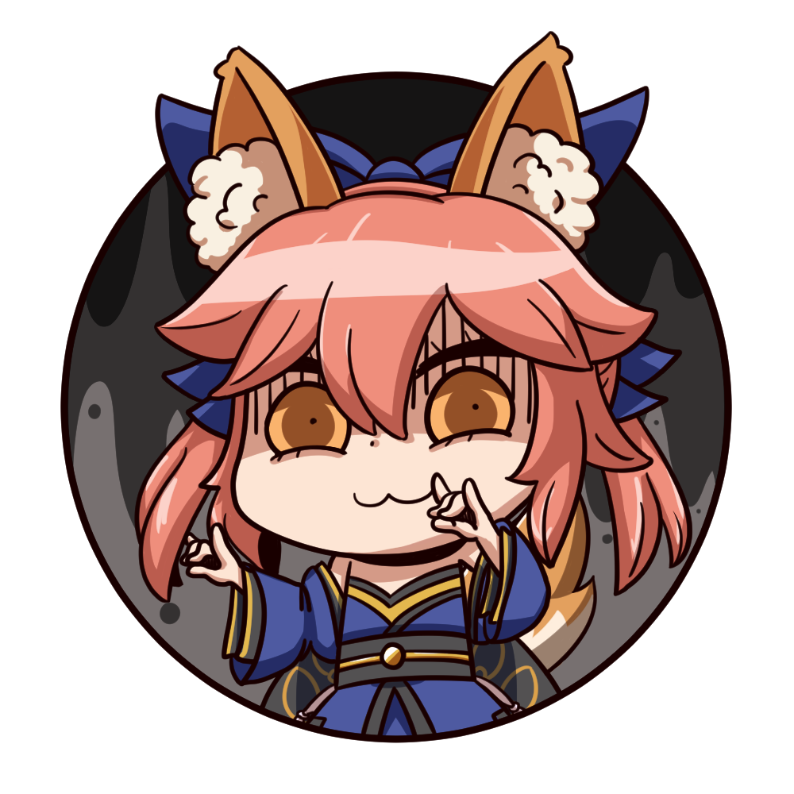

<html lang="en">
<head>
  <title>Tamamo Fan Website 1</title>
  <meta charset="UTF-8">
  <meta name="viewport" content="width=device-width, initial-scale=1">
  <link rel="stylesheet" href="https://cdnjs.cloudflare.com/ajax/libs/font-awesome/4.7.0/css/font-awesome.min.css">
  <link rel="icon" type="image/x-icon" href="images/tamamo_header.png">  
  
  
</head>

<body>

   
  
A website dedicated to Tamamo.

  <a class="active" href="#"><i class="fa fa-home"></i></a> 
  <a href="https://en.wikipedia.org/wiki/Tamamo-no-Mae">Sobre   Tamamo OG</a>
  <a href="https://typemoon.fandom.com/wiki/Tamamo-no-Mae">Sobre   Tamamo Fate</a>
  

    <button class="dropbtn">Temas musicales
      <i class="fa fa-caret-down"></i>
    </button>
    

       <button class="tablink" onclick="openPage('extra', this, 'blue')">An Extra Life with Anyone She Wants</button>
       <button class="tablink" onclick="openPage('extella', this, 'red')">Suiten Nikkou Amaterasu Yano Shizuishi </button>
       <button class="tablink" onclick="openPage('aria', this, 'yellow')">By Your Side</button>
      

        <h3>An Extra Life with Anyone She Wants</h3>
        
El tema de Tamamo, original en Fate/Extra.

      

      

        <h3>Suiten Nikkou Amaterasu Yano Shizuishi</h3>
        
El tema de Tamamo en Fate/Extella.

      

      

        <h3>By Your Side</h3>
        
El tema de Tamamo Aria en Fate/Samurai Remnant.

      

    

  

  <a href="https://fategrandorder.fandom.com/wiki/Tamamo_no_Mae">Tamamo   FGO</a>
  

    <button class="dropbtn">Tamamo Nine
      <i class="fa fa-caret-down"></i>
    </button>
    

        <button class="tablinks" onclick="openPage('origen', this, 'black')" id="defaultOpen">Origen</button> 
        <button class="tablinks" onclick="openPage('casko', this, 'blue')">Tamamo (Caster)</button> 
        <button class="tablinks" onclick="openPage('cat', this, 'red')">Tamamo Cat</button> 
        <button class="tablinks" onclick="openPage('aria', this, 'yellow')">Tamamo Aria</button> 
    

  

  <h3>El sorprendente origen del Tamamo Nine.</h3>
  
Tras lo que le sucedió a Tamamo, decidió cortarse todas las colas menos una para evitar que una tragedia similar pudiera repetirse.
 
  
Sin embargo, de las 8 colas, llenas de su divinidad, crecieron 8 espíritus similares a ella, formándose así el Tamamo Nine.

  <h3>Casko</h3>
  
La encarnación de la original y la mejor. Sale en Extra, Extra CCC, Extella, Extella Link y FGO. Muy confiable, gran esposa.
 
  
Es algo posesiva y sobreprotectora, aunque puede ser algo cruel con el resto.

  <h3>Tamamo Cat</h3>
  
Una de las colas de Tamamo. Obsesionada con cocinar, bastante loca y algo bocazas, aunque quizá de forma intencional para crear más caos.

  <h3>Tamamo Aria</h3>
  
Una de las colas de Tamamo. Su cuerpo y su mente son los de una versión mucho más infantil que el resto de las Tamamos.
 
  
También es bastante inocente, aunque puede tener una cierta posesividad innata a todas las Tamamos.

    <a target="_blank" title="Share on Bluesky" href="https://bsky.app/intent/compose?text=Check%20out%20this%20amazing%20content!">
        <svg width="1em" height="1em" fill="#fff" viewBox="0 0 600 600" xmlns="http://www.w3.org/2000/svg">
        <path d="m135.72 44.03c66.496 49.921 138.02 151.14 164.28 205.46 26.262-54.316 97.782-155.54 164.28-205.46 47.98-36.021 125.72-63.892 125.72 24.795 0 17.712-10.155 148.79-16.111 170.07-20.703 73.984-96.144 92.854-163.25 81.433 117.3 19.964 147.14 86.092 82.697 152.22-122.39 125.59-175.91-31.511-189.63-71.766-2.514-7.3797-3.6904-10.832-3.7077-7.8964-0.0174-2.9357-1.1937 0.51669-3.7077 7.8964-13.714 40.255-67.233 197.36-189.63 71.766-64.444-66.128-34.605-132.26 82.697-152.22-67.108 11.421-142.55-7.4491-163.25-81.433-5.9562-21.282-16.111-152.36-16.111-170.07 0-88.687 77.742-60.816 125.72-24.795z"/>
        </svg>
    </a>

  
<iframe width="100%" height="300" scrolling="no" frameborder="no" allow="autoplay" src="https://w.soundcloud.com/player/?url=https%3A//api.soundcloud.com/tracks/346345385&color=%23000eff&auto_play=true&hide_related=false&show_comments=true&show_user=true&show_reposts=false&show_teaser=true&visual=true"></iframe>
<a href="https://soundcloud.com/mika-mio" title="Mika Mio" target="_blank" style="color: #cccccc; text-decoration: none;">Mika Mio</a> · <a href="https://soundcloud.com/mika-mio/fate-extella-ost-tamamo-theme" title="Fate EXTELLA OST - Tamamo Theme An Extra Life With Anyone She Wants" target="_blank" style="color: #cccccc; text-decoration: none;">Fate EXTELLA OST - Tamamo Theme An Extra Life With Anyone She Wants</a>

<h1>Cessa's Website Trial 2</h1>

A website copied from the internet to learn.

</body>
</html> 
